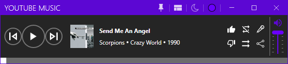
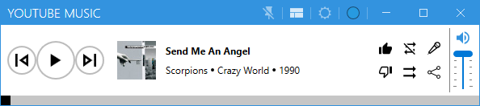

# Mini Youtube Music Controller (MYMC)

A lightweight desktop controller for YouTube Music built with .NET 9.0 and WPF, featuring a modern UI using MahApps.Metro.

## Features

- Control YouTube Music playback without switching windows
- Compact mode for minimal screen footprint
- Media controls (play/pause, next/previous, shuffle, repeat)
- Volume control with mute toggle
- Like/Dislike tracks
- Lyrics lookup via Genius API
- Always-on-top option
- Track progress bar with seeking
- Persistent user settings
- Dark and light themes
- Customizable theme colors from 23 preset options

## Screenshots
Dark Theme (Purple) | Light Theme (Blue)

## Requirements

- Windows OS
- .NET 9.0 Desktop Runtime
- WebView2 Runtime (automatically installed with most Windows updates)

## Installation

1. Download the latest installer from the releases page
2. Run the installer
3. If prompted, install the .NET 9.0 Desktop Runtime from [Microsoft's website](https://dotnet.microsoft.com/download/dotnet/9.0)

## Building from Source

1. Clone the repository
2. Open the solution in Visual Studio 2022 or later
3. Restore NuGet packages
4. Build the solution

### Dependencies

- CommunityToolkit.Mvvm (8.3.2)
- HtmlAgilityPack (1.11.71)
- MahApps.Metro (2.4.10)
- MahApps.Metro.IconPacks (5.1.0)
- Microsoft.Extensions.DependencyInjection (9.0.0)
- Microsoft.Web.WebView2 (1.0.2903.40)
- Serilog (4.1.0)
- SimMetrics.Net (1.0.5)

## Usage

1. Launch the application
2. Sign in to YouTube Music in the embedded browser
3. Use the controls at the bottom of the window to control playback
4. Toggle compact mode using the gallery/compact view button
5. Pin the window on top using the pin button
6. View lyrics by clicking the lyrics button when a song is playing

## Contributing

Pull requests are welcome. For major changes, please open an issue first to discuss what you would like to change.

## License

[MIT](LICENSE) - Copyright (c) 2024 Mustafa Can Yucel

## Acknowledgments

- [MahApps.Metro](https://github.com/MahApps/MahApps.Metro) for the modern UI components
- [Genius API](https://genius.com) for lyrics data